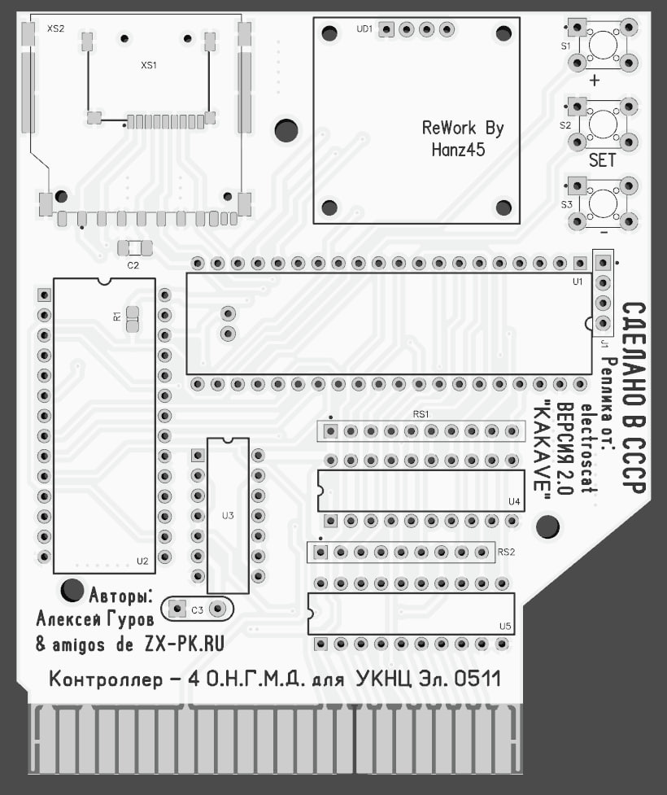
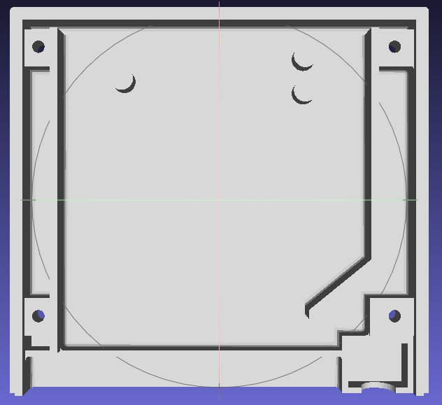
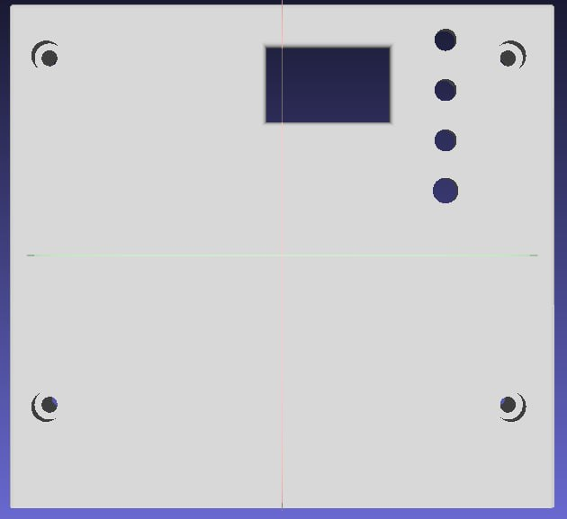
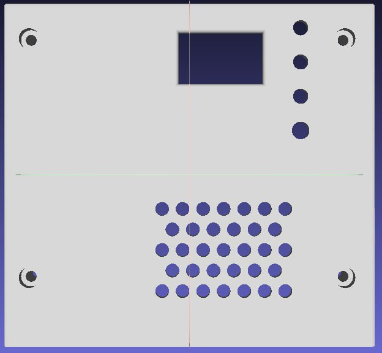
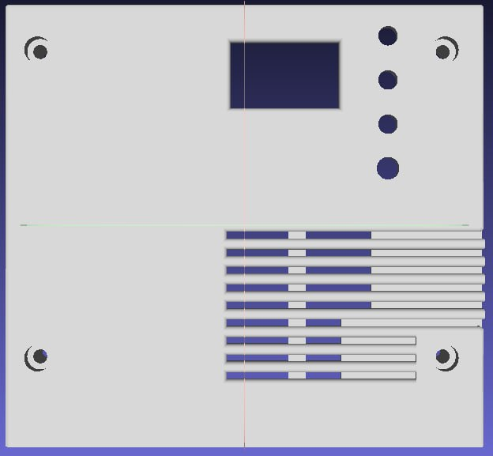
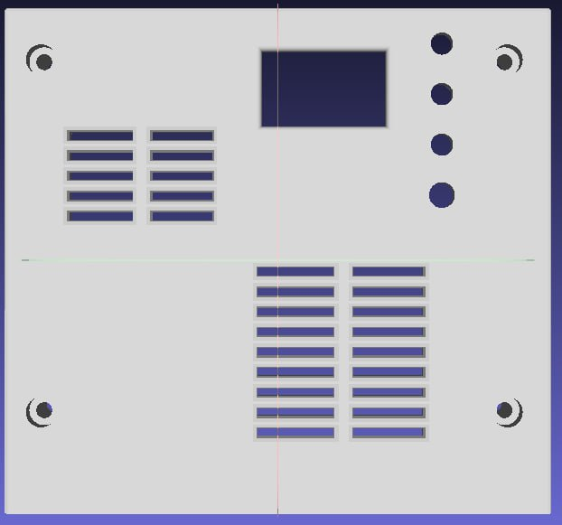

# kakave
<B>- Контроллер псевдо КМД+имитация 4х дисководов для УКНЦ (на SD карте)</B> 

<B>Идея:</B> 
Сделать простой для повторения и как можно более дешевый контроллер НГМД, который будет работать со встроенным в УКНЦ драйвером.

<B>Реализация:</B> 
Контроллер построен на базе платы Blackpill, имеющая на борту stm32f401 или stm32f411.

<B>Что работает:</B> 
Чтение/запись с образов DSK размером 800 кБ, поддерживаются образы имеющие нестандартные размеры, но запись не гарантируется.
Работают: RT-11, Unix и другие ОС, программное обеспечение и игры из-под ОС.

<B>Что не работает:</B> 
Нет поддержки каталогов. 
Игры от ИТО: ITO90.dsk - все игры с этого диска, ITO91.dsk - не работает PacMan.

<B>Ошибки:</B> 
На герберах перепутаны подписи под кнопками Left и Right. Кнопка Set расположена слишком близко к дисплею и мешает его установке.
В демонстрационном ролике старая модель корпуса с недостоверно подписанными светодиодными индикаторами. Индикаторы отображают сигнал "Мотор" и сигнал чтения/записи.

<B>Обратите внимание:</B> 
Платы BlackPill и олед-дисплея имеются в продаже с различающейся разводкой выводов.
При монтаже выводы разъема для программирования SCK и DIO запаиваются на плату. 

<B>Пример работы контроллера:</B> 

 
<B>Сообществом были произведены следующие улучшения:</B> 
Новая трассировка платы и гербер-файлы: <a href="Community/Gerber_new/">Community/Gerber_new/</a> 
 
Стильный корпус со сменными передними накладками, там же несколько моделей в сборе на "покрутить":<a href="Community/Case/">Community/Case/</a> 
 
 
 
 
 
<B>Авторы модов:</B> 
@electroscatnes 
Andrey Khristov 
<B>Идейные вдохновители:<B> 
Alexey Kisly 
@nzeemin 
и все участники канала: <a href="https://t.me/MC0511UKNC">https://t.me/MC0511UKNC</a>

