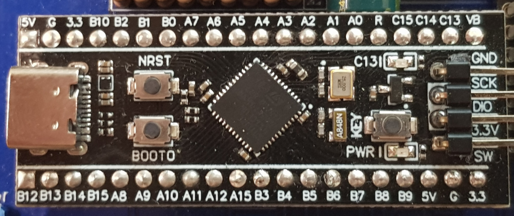
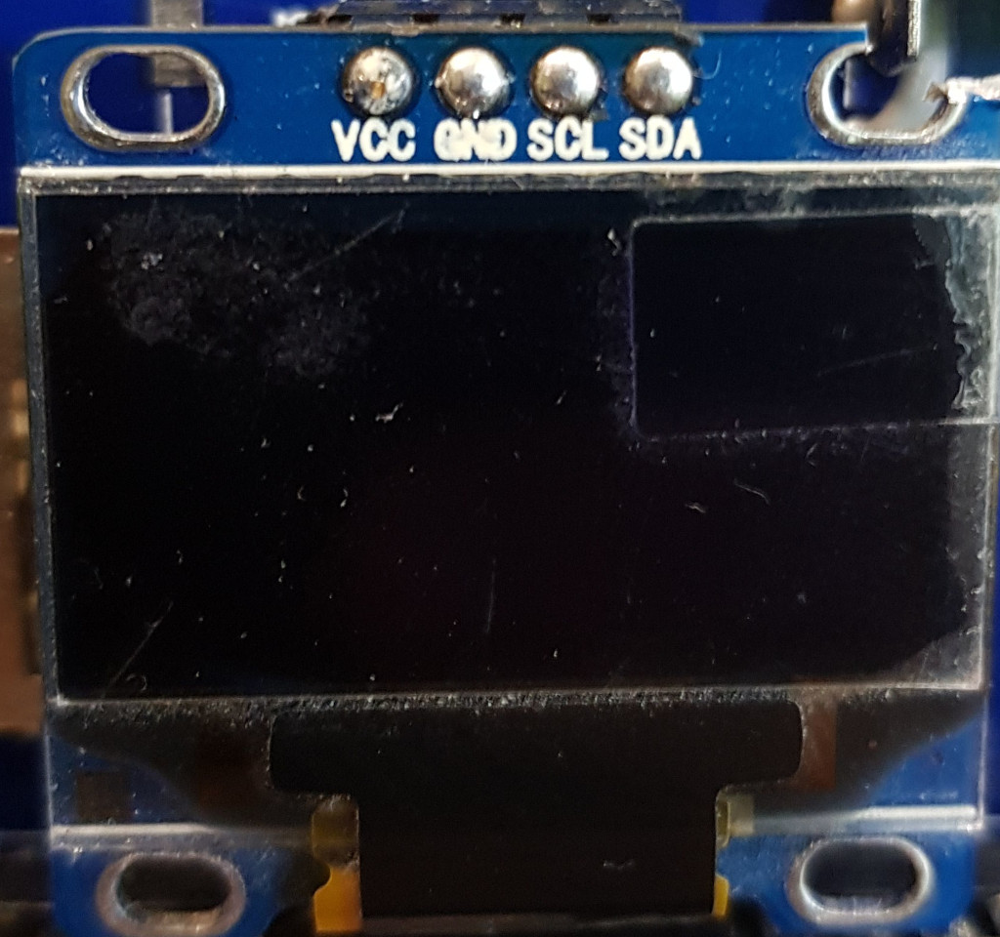

# kakave
<B>- Контроллер псевдо КМД+имитация 4х дисководов для УКНЦ (на SD карте)</B> 

<B>Идея:</B> 
Сделать простой для повторнеия и как можно более дешевый контроллер НГМД, который будет работать со встроенным в УКНЦ драйвером.

<B>Реализация:</B> 
Контроллер построен на плате Blackpill, которая базируется на контроллере от STM stm32f401 или stm32f411.

<B>Что работает:</B> 
Чтение/запись с образов DSK на 800 кБ, также поддерживаются образы меньшие по размерам, но запись не гарантируется.
Работают: RT-11, Unix и другие ОС, программное обеспечение и игры из-под ОС.

<B>Что не работает:</B> 
Нет поддержки каталогов.
Игры от ИТО: ITO90.dsk - все игры с этого диска, ITO91.dsk - не работает PacMan.

<B>Ошибки:</B> 
На герберах перепутаны подписи под кнопками Left/Right.
В демонстрационном ролике старая модель корпуса с недостоверно подписанными светодиодными индикаторами.

<B>Обратите внимание:</B> 
Платы BlackPill и олед-дисплеи имеют разные  виды разводки пинов.
При монтаже выводы разъема для программирования SCK и DIO запаиваются на плату. 

<B>Пример работы контроллера:</B> 

