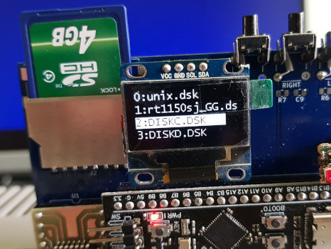
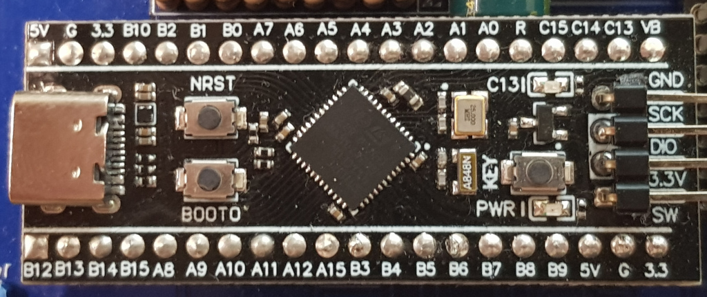
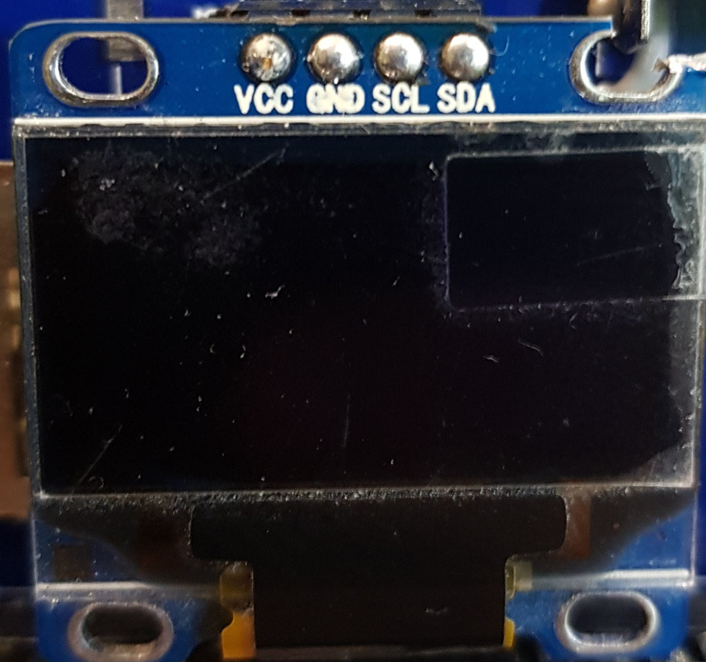
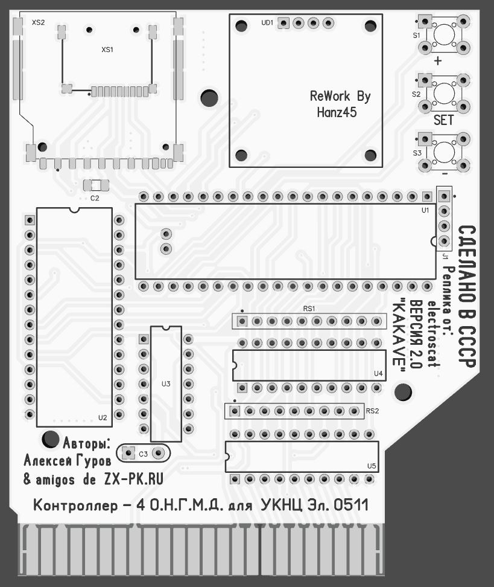
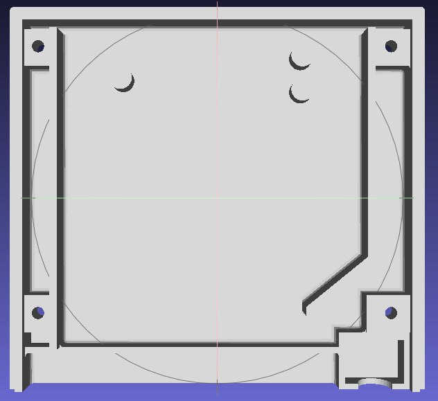
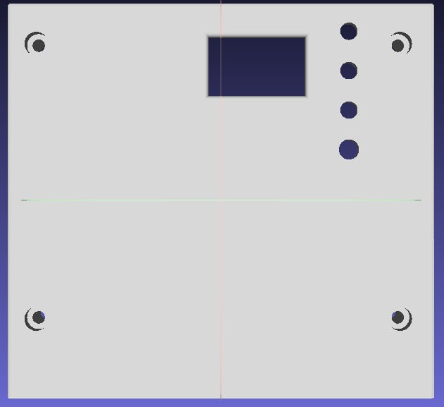
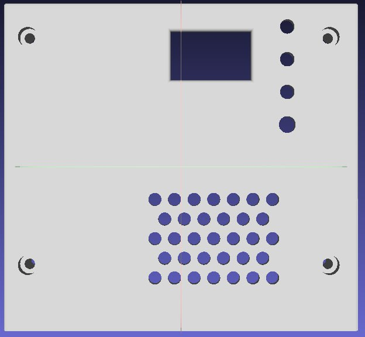
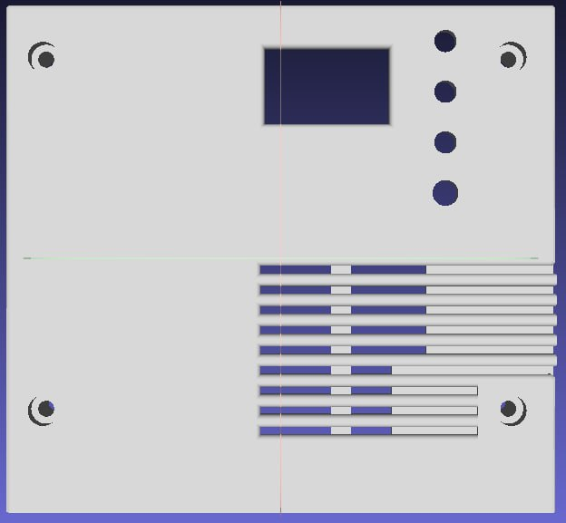
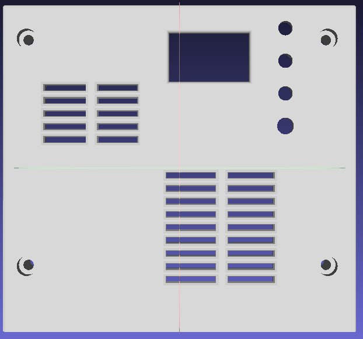

# kakave
<B>- Контроллер псевдо КМД+имитация 4х дисководов для УКНЦ (на SD карте)</B> 

<B>Идея:</B> 
Сделать простой для повторения и как можно более дешевый контроллер НГМД, который будет работать со встроенным в УКНЦ драйвером.

<B>Реализация:</B> 
Контроллер построен на базе платы Blackpill, имеющая на борту stm32f401 или stm32f411.

<B>Что работает:</B> 
Чтение/запись с образов DSK размером 800 кБ, поддерживаются образы имеющие нестандартные размеры, но запись не гарантируется.
Работают: RT-11, Unix и другие ОС, программное обеспечение и игры из-под ОС.

<B>Что не работает:</B> 
Нет поддержки каталогов. 
~~Игры от ИТО: ITO90.dsk - все игры с этого диска, ITO91.dsk - не работает PacMan.~~ (v1.1.0)

<B>Прошивка:</B> 
Готовые файлы записываются с адреса 0x08000000 (например, st-flash write f401test005.bin 0x08000000). Какой выбрать - по надписи на микроконтроллере Blackpill (или по chip id, который показывает st-info --probe): 
- firmware401/Release/f401test005.bin - STM32F401CC (CCU6, chip id 0x423: 256 кБ flash, 64 кБ RAM). Работает и на STM32F401CE. 
- firmware401/Release/f401cetest005.bin - STM32F401CE (CEU6, chip id 0x433: 512 кБ flash, 96 кБ RAM). Та же прошивка, собранная под CE: использует всю его память. На F401CC не работает. 
- firmware/Release/f411test005.bin - STM32F411CE (CEU6, chip id 0x431). Для STM32F401 не подходит: работает на 100 МГц. 
Все три работают с олед-дисплеями 128x64 (I2C, адрес 0x3C) на контроллерах SSD1306 (0.96"), SH1106 (1.3") и CH1116 (1.54"): тип контроллера определяется при включении по его байту состояния. 
Сборка из командной строки: make (результат в build/), make release - собрать и положить в */Release/. Нужен arm-none-eabi-gcc в PATH или make TOOLCHAIN=&lt;каталог bin&gt;. 
Файлы в */Release/ собраны GNU Arm Embedded 7-2018-q2-update (GCC 7.3.1, тот же компилятор, что в STM32CubeIDE 1.4): с ним make даёт точно такие же файлы. Более новые GCC (проверено 13.2) тоже собирают, но код получается другим. 

<B>Ошибки:</B> 
На герберах перепутаны подписи под кнопками Left и Right. Кнопка Set расположена слишком близко к дисплею и мешает его установке.
В демонстрационном ролике старая модель корпуса с недостоверно подписанными светодиодными индикаторами. Индикаторы отображают сигнал "Мотор" и сигнал чтения/записи.

<B>Обратите внимание:</B> 
Платы BlackPill и олед-дисплея имеются в продаже с различающейся разводкой выводов.
При монтаже выводы разъема для программирования SCK и DIO запаиваются на плату. 

<B>Пример работы контроллера:</B> 

 
<B>Сообществом были произведены следующие улучшения:</B> 
Новая трассировка платы и гербер-файлы: <a href="Community/">Community</a> 
 
Стильный корпус со сменными передними накладками, там же несколько моделей в сборе 
 
 
 
 
 
<B>Авторы модов:</B> 
@electroscatnes 
Andrey Khristov 
<B>Идейные вдохновители:<B> 
Alexey Kisly 
@nzeemin 
и все участники канала: <a href="https://t.me/MC0511UKNC">https://t.me/MC0511UKNC</a>

## CHANGELOG

v1.1.0 Правки
- исправлена ошибка загрузки игр с ITO дисков
- добавлена поддержка больших экранов на чипе CH1116
- добавлен CE build

v1.0.0 Исходная публичная версия

