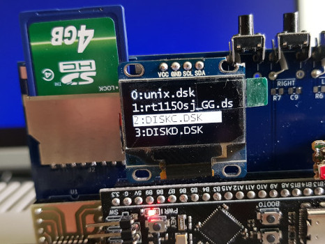

# kakave - Контроллер псевдо КМД+имитация 4х дисководов для УКНЦ (на SD карте)

# Идея:
Сделать простой для повторнеия и как можно более дешевый контроллер НГМД, который будет работать со встроенным в УКНЦ драйвером.

# Реализация:
Контроллер построен на плате Blackpill, которая базируется на контроллере от STM stm32f401 или stm32f411.

# Что работает: 
Чтение/запись с образов DSK на 800 кБ, также поддерживаются образы меньшие по размерам, но запись не гарантируется.
Работают: RT-11, Unix и другие ОС, программное обеспечение и игры из-под ОС.

# Что не работает:
Нет поддержки каталогов.
Игры от ИТО: ITO90.dsk - все игры с этого диска, ITO91.dsk - не работает PacMan.

# Ошибки:
На герберах перепутаны подписи под кнопками Left/Right.
В демонстрационном ролике старая модель корпуса с недостоверно подписанными светодиодными индикаторами.

# Обратите внимание:
Платы BlackPill и олед-дисплеи имеют разные  виды разводки пинов.

# Пример работы контроллера:

